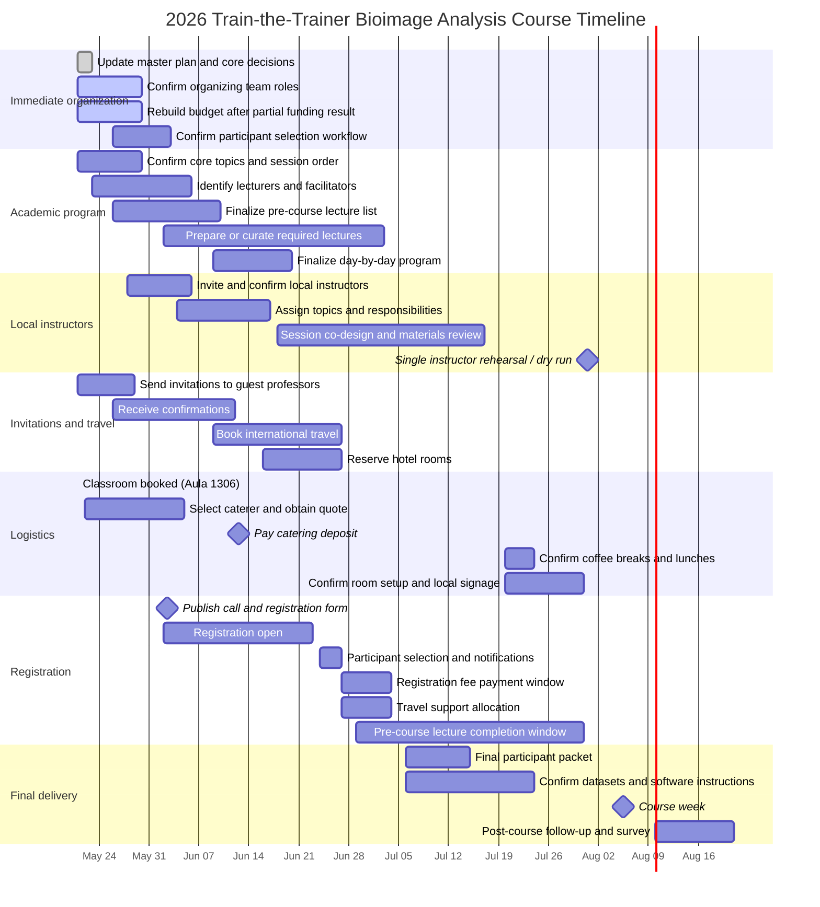

# Train-the-Trainer Course on Bioimage Analysis — Master Plan

## Executive summary
This document is the **working master plan** for organizing a **Train-the-Trainer course on Bioimage Analysis** aimed at participants from **LATAM**, especially microscopy facility staff, image analysts, and researchers who will later teach these topics in their own institutions.

**Current planning assumptions**
- **Confirmed course dates:** 2026-08-03 to 2026-08-07
- **Format:** fully **on-site** train-the-trainer course with **required asynchronous pre-course lectures** and in-person sessions
- **Confirmed classroom:** **Aula 1306, Pabellón 0+Infinito, Facultad de Ciencias Exactas y Naturales (FCEN-UBA)**
- **Working language:** English
- **Primary goal:** train participants not only to use bioimage analysis methods, but also to **teach them effectively** and replicate training in their home institutions
- **Participant count:** 24 participants
- **Regional scope:** Argentina and LATAM, with invited contributions from Uruguay, Sweden, and international bioimage-analysis networks
- **Current funding reality:** the broader FUNDACEN proposal requested **AR$ 10.004.000**, but only **AR$ 2.000.000** is available for now; this makes prioritization essential
- **Priority constraints:** invited-professor travel, participant support, local instructor preparation time, required pre-course lecture production/curation, catering, and funding allocation
- **Recent confirmed planning updates (2026-05-22):** registration timeline moved one week earlier; catering provider decision should be closed within two weeks; catering should ideally include the social dinner, while lunches are desirable but lower priority; local instructor invitations shift one week later, with no dedicated pedagogy onboarding and a single rehearsal

**Primary outputs of the project**
1. A coherent course program with topic leads and teaching rationale
2. A clear operational plan for logistics and administration
3. A shortlist of invited professors with costs and funding sources
4. A defined local instructor coordination plan with topic assignment, materials review, and a single rehearsal
5. A pre-course lecture package that participants must complete before arrival
6. A realistic timeline with milestones, deliverables, and deadlines
7. A future-ready folder structure plan for storing materials once implementation starts

---

## Gantt chart — milestones, deliverables, and deadlines

---

## Priority to-do list

### Immediate next actions
- [ ] Confirm the **organizing committee** and assign one owner for logistics, one for program, one for budget, and one for communications.
- [x] Confirm classroom booking: **Aula 1306, Pabellón 0+Infinito, FCEN-UBA**.
- [x] Confirm delivery format: **fully on-site, no virtual option**.
- [x] Confirm course dates: **2026-08-03 to 2026-08-07**.
- [x] Confirm working language: **English**.
- [x] Confirm target participant count: **24**.
- [ ] Update the budget to reflect that only **AR$ 1.000.000** is available for now from the requested FUNDACEN support.
- [ ] Decide which budget lines this first tranche should protect: invited professors, coffee breaks, or participant support.
- [ ] Prepare and send invitations to priority guest professors.
- [ ] Invite local instructors/facilitators formally starting one week later than previously planned, and confirm their availability.
- [ ] Estimate required coordination time per local instructor under the lighter prep model and block the single rehearsal in the calendar.
- [ ] Finalize the list of **required pre-course lectures** and define how completion will be tracked.

### Program and content
- [ ] Approve the core list of topics.
- [ ] Decide which topics need pre-recorded lectures versus live workshop review.
- [ ] Identify topic leads for each session.
- [ ] Define expected prerequisites for participants.
- [ ] Decide on the balance between ImageJ/Fiji, Python, napari, and deep-learning tools.
- [ ] Build an internal training plan so local instructors can co-teach confidently.

### Logistics and administration
- [ ] Request catering quotes for coffee breaks, the ideally included social dinner, and optional lunches; close the provider decision within two weeks.
- [ ] Define registration categories and fee waivers.
- [ ] Decide whether hotel booking will be centralized or reimbursed.
- [ ] Define reimbursement workflow for invited professors.
- [ ] Finalize the registration form and participant selection rubric for publication one week earlier.
- [ ] Confirm room layout and daily operational needs for Aula 1306.

### Communications
- [ ] Draft course description for dissemination.
- [ ] Prepare a save-the-date announcement.
- [ ] Identify mailing lists, societies, and networks for outreach.
- [ ] Define the official contact email and response owner.
- [ ] Draft invitation/coordination email for local instructors and facilitators.

---

## Proposed folder structure plan — do not create yet
The project should eventually be organized into separate folders, but **they should not be created yet**.

| Planned folder | Purpose |
|---|---|
| `01_admin/` | approvals, official requests, institutional letters, contact list |
| `02_program/` | overall schedule, day-by-day program, session design |
| `03_topics/` | one file per topic with rationale, resources, exercises, and lecturer notes |
| `04_lectures/` | pre-course lecture links, abstracts, slides, recordings |
| `05_invited-professors/` | invitation tracking, bios, travel, reimbursement, hotel notes |
| `06_budget-funding/` | budget versions, quotes, sponsor options, registration-fee model |
| `07_logistics/` | classroom, catering, AV support, signage, accessibility, local operations |
| `08_registration-selection/` | call text, form questions, rubric, acceptance and waitlist tracking |
| `09_communications-outreach/` | website copy, mailing text, posters, social posts |
| `10_materials-datasets/` | datasets, installation instructions, software environment notes |
| `11_meetings-notes/` | meeting minutes, action items, decision log |
| `12_archive/` | deprecated versions and post-course archiving |

---

## Course concept and teaching model

### Why this course
The region needs more people who can both **do bioimage analysis** and **teach it sustainably**. A train-the-trainer format helps multiply impact: each participant is expected to return to their institution and replicate or adapt parts of the material for local training.

### How the format should work
1. **Before the workshop**
   - Participants must watch required lectures or curated recordings before attending.
   - Participants review key readings and software installation instructions.
   - Participants complete a short pre-course survey on background and teaching goals.
   - Pre-course material is mandatory so that in-person time can focus on pedagogy rather than first exposure.
2. **During the workshop**
   - Each session starts with a concise expert summary of approximately **30-45 minutes**.
   - The group then uses Q&A to clarify conceptual or methodological gaps.
   - The remainder of the session is dedicated to pedagogy: how to teach the topic, how to design an exercise, where learners struggle, and how to assess learning.
   - All activities are **on-site only**; no virtual participation track is planned.
3. **After the workshop**
   - Participants receive reusable teaching materials.
   - A community channel or mailing list supports follow-up.
   - Participants are encouraged to run local training activities within 6-12 months.

### Learning objectives
By the end of the course, participants should be able to:
- explain core bioimage analysis topics to learners with mixed backgrounds,
- select appropriate tools for common analysis problems,
- design practical teaching activities and datasets,
- identify typical learner misconceptions,
- evaluate whether students achieved the intended learning goals,
- adapt the material to local constraints in infrastructure, time, and expertise.

---

## Topics and program overview

### Topic map
- [Topic 1. Image processing fundamentals](#topic-1-image-processing-fundamentals)
- [Topic 2. Segmentation and quantitative analysis](#topic-2-segmentation-and-quantitative-analysis)
- [Topic 3. Reproducible workflows with Fiji, Python, and napari](#topic-3-reproducible-workflows-with-fiji-python-and-napari)
- [Topic 4. Machine learning for bioimage analysis](#topic-4-machine-learning-for-bioimage-analysis)
- [Topic 5. Deep learning foundations and segmentation](#topic-5-deep-learning-foundations-and-segmentation)
- [Topic 6. Designing exercises, assessments, and teaching strategies](#topic-6-designing-exercises-assessments-and-teaching-strategies)
- [Topic 7. Building local training capacity](#topic-7-building-local-training-capacity)

### Proposed 5-day structure
| Day | Focus | Main output |
|---|---|---|
| Day 1 | course framing, image processing fundamentals, pedagogy setup | shared baseline and teaching goals |
| Day 2 | segmentation and quantitative analysis | analysis exercise and teaching notes |
| Day 3 | reproducible workflows and tool ecosystems | reusable workflow examples |
| Day 4 | machine learning and deep learning | realistic expectations and teaching strategy |
| Day 5 | training design, assessment, and institutional replication | local action plan per participant |

### Session design template
For each major topic, use an in-person block built around prior lecture completion:
- **30-45 min** — concept recap and framing
- **30-45 min** — Q&A and discussion of problem cases
- **remaining time** — train-the-trainer workshop: teach-back, exercise design, assessment planning, and adaptation to local contexts

---

## Topic 1. Image processing fundamentals
**Why this topic matters**  
Participants need a common language for images, sampling, noise, contrast, filtering, and artifacts. Without this, later segmentation and ML topics are difficult to teach responsibly.

**How to teach it in train-the-trainer mode**
- Use a small set of representative biological images.
- Compare correct and incorrect preprocessing decisions.
- Ask participants to explain the same concept to three audiences: beginners, wet-lab researchers, and facility staff.

**Suggested practical activity**
- Build a mini-lesson around noise reduction, contrast adjustment, and measurement bias.

**Candidate tools**
- Fiji/ImageJ
- napari
- Python notebooks

**Planned future file**
- `03_topics/image-processing-fundamentals.md`

---

## Topic 2. Segmentation and quantitative analysis
**Why this topic matters**  
Segmentation is central to extracting measurements from microscopy data, and it is often where poor assumptions lead to misleading biology.

**How to teach it in train-the-trainer mode**
- Present multiple segmentation strategies for the same dataset.
- Discuss annotation, ground truth, thresholds, and validation.
- Emphasize when not to trust automated output.

**Suggested practical activity**
- Participants compare a threshold-based workflow, a classical workflow, and a learned model on the same image set, then design an exercise for their local audience.

**Candidate tools**
- Fiji/ImageJ
- Cellpose or ilastik where appropriate
- Python/scikit-image

**Planned future file**
- `03_topics/segmentation-quantification.md`

---

## Topic 3. Reproducible workflows with Fiji, Python, and napari
**Why this topic matters**  
Future trainers need to teach not just a result, but a reproducible workflow that others can rerun, inspect, and adapt.

**How to teach it in train-the-trainer mode**
- Show the same problem solved through GUI and scripted approaches.
- Discuss trade-offs: accessibility, transparency, scalability, maintenance.
- Include software installation guidance and environment management.

**Suggested practical activity**
- Convert a manual analysis workflow into a documented semi-automated or scripted workflow.

**Candidate tools**
- Fiji macros
- Python notebooks / scripts
- napari plugins
- Pixi or environment manager of choice

**Planned future file**
- `03_topics/reproducible-workflows.md`

---

## Topic 4. Machine learning for bioimage analysis
**Why this topic matters**  
Participants should be able to explain what ML can and cannot do, when it adds value, and how to present model limitations responsibly to learners.

**How to teach it in train-the-trainer mode**
- Focus on concepts before tools.
- Use examples of dataset bias, overfitting, domain shift, and evaluation.
- Ask participants to redesign overly optimistic course descriptions into realistic learning objectives.

**Suggested practical activity**
- Evaluate a model on out-of-domain images and discuss how to teach caution, benchmarking, and validation.

**Candidate tools**
- ilastik
- Python notebooks
- selected reproducible demos

**Planned future file**
- `03_topics/machine-learning.md`

---

## Topic 5. Deep learning foundations and segmentation
**Why this topic matters**  
Deep learning is now a major expectation in bioimage analysis training, but it must be taught with careful framing around data needs, compute, annotation, transferability, and failure cases.

**How to teach it in train-the-trainer mode**
- Separate conceptual literacy from full technical implementation.
- Teach participants how to choose the right depth for their audience.
- Include a discussion on GPU access, pre-trained models, and realistic institutional constraints in LATAM.

**Suggested practical activity**
- Build a teaching plan for introducing deep-learning segmentation using a pre-trained tool plus a critical discussion of validation.

**Candidate tools**
- Cellpose / StarDist where relevant
- napari plugins
- Python-based demos

**Planned future file**
- `03_topics/deep-learning-segmentation.md`

---

## Topic 6. Designing exercises, assessments, and teaching strategies
**Why this topic matters**  
This is the core train-the-trainer layer: participants must leave with practical teaching methods, not just topic exposure.

**How to teach it in train-the-trainer mode**
- Use backward design: learning objective -> activity -> assessment.
- Compare weak versus strong exercise design.
- Include peer feedback on mini-teaching plans.

**Suggested practical activity**
- Each participant drafts one local teaching activity, one assessment item, and one adaptation for limited-resource settings.

**Planned future file**
- `03_topics/teaching-design-and-assessment.md`

---

## Topic 7. Building local training capacity
**Why this topic matters**  
The course should generate a network of trainers, not an isolated event.

**How to teach it in train-the-trainer mode**
- Discuss how to run small local workshops, how to partner with facilities, and how to curate reusable materials.
- Encourage realistic replication plans instead of overly ambitious commitments.

**Suggested practical activity**
- Draft a 6-month replication plan for each participant's institution or network.

**Planned future file**
- `03_topics/local-capacity-building.md`

---

## Suggested day-by-day program

### Day 1 — Foundations and framing
- Welcome, goals, participant expectations
- Why a train-the-trainer format for LATAM
- Image processing fundamentals
- Pedagogy module: how to teach concepts to mixed audiences

### Day 2 — Segmentation and measurement
- Segmentation strategies and validation
- Quantitative analysis and common pitfalls
- Workshop: building exercises from real microscopy examples

### Day 3 — Workflows and reproducibility
- Fiji, Python, napari ecosystem overview
- Reproducible analysis design
- Workshop: converting examples into teachable workflows

### Day 4 — ML and deep learning
- ML concepts for bioimage analysis
- Deep-learning segmentation: opportunities and limitations
- Workshop: how to teach ML responsibly without overselling it

### Day 5 — Teaching practice and replication
- Assessment design
- Participant mini teach-backs
- Institutional adaptation plans
- Closing discussion and follow-up network

---

## Organization and logistics

### Venue and infrastructure
**Confirmed venue**
- **Aula 1306, Pabellón 0+Infinito, Facultad de Ciencias Exactas y Naturales (FCEN-UBA)**

**Needs**
- Classroom for 24 participants plus instructors
- Reliable projector and sound
- Strong Wi-Fi
- Power outlets for laptops
- Space for coffee breaks nearby

**Actions**
- Confirm whether participants bring laptops or whether any local equipment is needed.
- Confirm room layout, signage, and access schedule.
- Confirm projector, audio, and connectivity for on-site teaching.

### Catering
**Minimum services needed**
- Morning coffee break
- Afternoon coffee break

**Preferred additional services**
- **Ideal / higher priority:** one social dinner or networking dinner should be included if feasible
- **Ideal / lower priority:** lunches for each course day should also be included if feasible, but are lower priority than the social dinner

**Operational notes**
- Obtain at least 2-3 quotes.
- Verify dietary restrictions in registration form.
- Confirm payment deadlines and deposit requirements early.
- When comparing providers, prioritize options that can include the social dinner; treat lunches as desirable but secondary if budget or vendor availability is tight.

### Accommodation and local transport
**For invited professors**
- Hotel close to venue or with easy transport
- Airport transfer instructions
- Reimbursement rules communicated in advance

**For selected participants with support**
- Define eligibility criteria for travel/hotel support.
- Clarify whether support is prepaid or reimbursed.

### Registration and participant selection
**Recommended selection criteria**
- current role in imaging, analysis, core facility support, or teaching,
- level of bioimage-analysis expertise and readiness for an advanced train-the-trainer format,
- previous teaching, mentoring, workshop facilitation, or trainee-support experience,
- whether the applicant works in an environment where they are likely to continue teaching or supporting training after the course,
- balance across geography, institutions, and professional profiles,
- minimum technical prerequisites.

**Selection note**
- Do **not** require formal evidence that applicants can replicate a training locally.
- Instead, use the form to understand their expertise, teaching experience, and whether their work environment gives them realistic opportunities to keep teaching.

**Recommended registration fields**
- full name,
- email,
- institution, country, department/unit,
- current role,
- career stage,
- previous bioimage analysis experience,
- software background,
- current teaching / mentoring / training responsibilities,
- previous teaching or workshop experience,
- work environment and opportunities to continue teaching or supporting trainees,
- motivation for attending,
- topics of strongest expertise,
- topics where training is most needed,
- need for financial support,
- dietary/accessibility needs.

**Draft registration form question set**
1. Full name
2. Email address
3. Institution
4. Department, lab, core facility, or program
5. Country
6. Current role / position
7. Career stage
8. Briefly describe your current work related to microscopy, bioimage analysis, image data management, or training.
9. How would you describe your experience in bioimage analysis?
   - beginner
   - intermediate
   - advanced
   - advanced trainer / specialist
10. Which tools have you used? (check all that apply)
    - Fiji / ImageJ
    - Python
    - napari
    - ilastik
    - Cellpose / StarDist / related tools
    - deep-learning workflows
    - other
11. Briefly describe the kinds of image-analysis problems you work on most often.
12. Have you taught, co-taught, mentored, or supported training in bioimage analysis, microscopy, image processing, or related topics?
    - no
    - yes, occasionally
    - yes, regularly
13. If yes, what formats have you participated in? (check all that apply)
    - university course
    - workshop
    - short tutorial
    - one-on-one mentoring
    - facility/user support
    - online training
    - other
14. Briefly describe your teaching or training experience, including topics and audience.
15. Do you currently work in an environment where you can continue teaching, mentoring, or supporting trainees after this course?
    - yes, clearly
    - possibly / partially
    - not yet, but I am trying to build this
    - no
16. If applicable, describe the setting in which you could continue teaching or trainee support (course, facility, lab, network, graduate program, workshops, etc.).
17. What topics in this course are you most confident teaching or explaining to others?
18. What topics do you most need help with in order to teach them better?
19. Why do you want to participate in this train-the-trainer course?
20. What do you expect to apply in your own academic, facility, or training context after the course?
21. Do you need financial support to attend?
22. If yes, what kind of support would be most important?
    - travel
    - accommodation
    - registration waiver / fee support
    - partial support only
23. Dietary restrictions or food allergies
24. Accessibility or participation needs

### Communications
**Channels to use**
- microscopy and image-analysis mailing lists,
- regional networks,
- partner institutions,
- social posts through organizers and networks,
- direct invitations to strategic facilities and trainers.

**Communication pieces needed**
- save-the-date,
- registration call,
- acceptance letter,
- waitlist letter,
- invited-speaker briefing,
- participant practical information packet,
- local instructor invitation and coordination brief,
- pre-course lecture instructions and completion reminder.

### Local instructor coordination and preparation
The FUNDACEN materials make clear that **local teaching staff are a major in-kind contribution** from FCEN-UBA. To use that contribution well, the project should plan a lighter but explicit coordination workload instead of assuming facilitators can join at the last minute.

**Confirmed preparation model per local instructor**
- **Initial invitation and role confirmation:** 30-45 min
- **Course coordination meeting:** 1 h
- **Topic-specific co-design meetings:** 1-2 meetings x 1.5 h
- **Asynchronous review of materials and datasets:** 3-5 h
- **Single dry run / rehearsal:** 2 h

**Estimated preparation time per person:** **7-11 hours**

**What local instructors should be invited to do**
- facilitate practical sessions and Q&A,
- help adapt examples to local audiences,
- review instructions and datasets,
- support participant troubleshooting,
- contribute to one coordinated rehearsal before the course.

**Operational recommendation**
- Send local invitations **one week later than previously planned**, with formal invitations out by **2026-06-06**.
- Confirm topic assignments by **2026-06-17**.
- Run coordination and co-design during **June-July 2026**.
- Hold a **single rehearsal** in **late July 2026**.

---

## Invited professors and facilitators

### Priority invited professors
| Name / group | Institution and country | Proposed role | Status | Rough expense estimate | Proposed funding source | Notes |
|---|---|---|---|---:|---|---|
| Dr. Federico Lecumberry | Universidad de la República, Uruguay | invited expert in bioimage analysis; possible contribution in segmentation / ML and advanced discussion | In management / to confirm | Included in invited-professor pool | FUNDACEN invited-professor budget + registration income if needed | Regional in-person speaker; should be prioritized if funding is limited |
| BIIF representative (1-2) | BioImage Informatics Facility (BIIF), Sweden | train-the-trainer perspective, workflows, good practices, international expertise | In management / to confirm | Included in invited-professor pool | external support if available; otherwise only if budget allows | High-value but expensive in-person participation |
| GloBIAS representative (e.g. Rocco D'Antuno) | Global BioImaging Analytical Support | global/community perspective; in-person contribution only if travel can be supported | In management / to confirm | To be confirmed if invited on-site | would require dedicated travel support | No virtual participation track is planned |
| Dr. Enzo Ferrante | Local participation | local expert contribution, potentially ML / DL or program support | Expected local participation | Low local cost | local institutional support | No major travel burden anticipated |

### Local instructors / facilitators
| Name | Institutional role | Expected course role | Status | Estimated preparation time | Notes |
|---|---|---|---|---|---|
| Lorena Sigaut | Jefe de Trabajos Prácticos con dedicación exclusiva, Departamento de Física | docente / local instructor | To invite formally / likely available | 9-11 h | should be involved early in session design and teaching coordination |
| Alejandra Fernández | Estudiante de doctorado | facilitadora de talleres | To invite formally | 7-10 h | can support hands-on exercises and participant guidance |
| Mauro Silberberg | Estudiante de doctorado | facilitador de talleres | To invite formally | 7-10 h | can support practical sessions and technical troubleshooting |
| Ignacio Sallaberry | Estudiante de doctorado | facilitador de talleres | To invite formally | 7-10 h | topic allocation and support role to confirm |
| Candela Szischik | Estudiante de doctorado | facilitadora de talleres | To invite formally | 7-10 h | can support pedagogical activities and exercise facilitation |

### Invitation strategy
1. Invite one **regional in-person guest** first.
2. Invite one **high-value international guest** only if the updated budget allows.
3. If travel support is not feasible, deprioritize those invitations rather than planning remote participation.
4. Ensure each invited guest has a clearly defined teaching role, not just a research seminar slot.
5. In parallel, invite all local instructors early enough to allow meaningful co-design, materials review, and the single rehearsal.

### Local instructor preparation milestones
- Formal invitation sent: **by 2026-06-06**
- Availability confirmed: **by 2026-06-13**
- Topic assigned: **by 2026-06-17**
- Coordination kickoff completed: **by 2026-06-27**
- Materials reviewed: **by 2026-07-17**
- Single rehearsal completed: **by 2026-07-31**

### Booking deadlines for invited professors
- Invitation sent: **no later than 2026-05-29**
- Confirmation received: **no later than 2026-06-12**
- Flight booking: **by 2026-06-27**
- Hotel booking: **by 2026-06-27**
- Final talk/session title: **by 2026-07-10**

---

## Budget and funding

### Budget context from FUNDACEN documents
The train-the-trainer course is part of a broader training proposal submitted to FUNDACEN. The broader proposal requested **AR$ 10.004.000** in FUNDACEN support across two workshops, while the **total project cost** was estimated at **AR$ 15.298.000**.

For the **Análisis de Bioimágenes / Train-the-Trainer** workshop, the FUNDACEN documents specify:
- **Total workshop cost:** **AR$ 9.931.000**
- **Invited professors:** **AR$ 4.020.000**
- **Coffee breaks:** **AR$ 1.775.000**
- **Economic assistance for participants:** **AR$ 4.136.000**
- **Expected registration income:** **AR$ 1.701.600**
- **Original FUNDACEN request associated with this workshop:** **AR$ 8.229.400**

### Current funding status
- **Requested from FUNDACEN (broader proposal):** AR$ 10.004.000
- **Currently available from FUNDACEN for now:** **AR$ 1.000.000**
- **Expected income from registrations across the broader proposal:** **AR$ 4.254.000**
- **Implication for this course:** the bioimage-analysis workshop still has a substantial funding gap, especially for invited professors and participant support

### Bioimage-analysis workshop priority budget lines under constrained funding
| Budget line | Amount (AR$) | Priority under current constraints | Notes |
|---|---:|---|---|
| Invited professors | 4.020.000 | High | Protect at least one regional in-person guest; additional guests depend on on-site travel support |
| Coffee breaks (+ ideally social dinner, and lunches if feasible) | 1.775.000 | Medium | Important for participant experience; prioritize including the social dinner, and include lunches only if budget and vendor options allow |
| Participant travel / hotel support | 4.136.000 | High | Critical for federal participation, but may need a smaller number of bursaries |

### Suggested use of the currently available AR$ 2.000.000
| Option | Description | Pros | Risks |
|---|---|---|---|
| Option A | Prioritize one regional invited professor + minimal coffee breaks | Protects academic quality and external visibility | Reduces inclusion support |
| Option B | Prioritize participant support bursaries | Improves federal access and inclusion | Harder to bring international experts in person |
| Option C | Mixed strategy: regional professor + limited bursaries + partial catering | Balanced approach | No budget line fully covered |

### Funding model to build
| Cost category | Primary proposed source | Backup source | Status |
|---|---|---|---|
| Invited professors | partial FUNDACEN + registration income | external sponsor / reduced invited-speaker slate | Urgent review needed |
| Coffee breaks | registration fees | institutional event support | Needs update |
| Participant support | FUNDACEN partial support | sponsor / reduced bursary model | Needs update |
| Local materials and operations | host institution in kind | registration fees | FCEN support expected |
| Local teaching staff time | FCEN in-kind contribution | not budgeted separately yet | Track explicitly as institutional contribution |

### Registration-fee model from FUNDACEN materials
The broader proposal uses a differentiated fee scheme and includes waivers for FCEN students. For this course, fee categories should be aligned with the approved institutional mechanism before publication.

### Budget decisions still needed
- How should the current **AR$ 2.000.000** be allocated across invited professors, coffee breaks, and participant support?
- Will invited-professor costs be covered centrally or should the invited-speaker slate be reduced to fit an on-site-only format?
- Will participant travel support be a fixed number of grants or a reimbursement ceiling?
- Can sponsors support coffee breaks, dinner, or travel bursaries?
- Is there any additional local or international funding still pending (e.g. Company of Biologists or other calls)?

---

## Open questions and decisions needed
1. Given the current partial funding, is there enough budget to bring one European invited professor in person?
2. How should the currently available **AR$ 2.000.000** be allocated?
3. Will the course issue certificates, and who signs them?
4. Will registration fees be charged in local currency, USD equivalent, or through institutional payment channels?
5. What exact prerequisites should be required to keep the course at an advanced but teachable level?
6. Which local instructors can commit the required **7-11 hours** of preparation time before the course?
7. How will completion of the required pre-course lectures be tracked and enforced?

---

## Decision log
| Date | Decision | Status |
|---|---|---|
| 2026-05-21 | Use `COURSE_MASTER_PLAN.md` as the main planning document | Done |
| 2026-05-21 | Keep a planned folder structure but do not create folders yet | Done |
| 2026-05-21 | Set the course dates to **2026-08-03 to 2026-08-07** | Done |
| 2026-05-21 | Course format will be **fully on-site** with **no virtual option** | Done |
| 2026-05-21 | Require participants to watch lectures before the course so in-person sessions can focus on pedagogy | Done |
| 2026-05-21 | Confirm working language as **English** | Done |
| 2026-05-21 | Confirm participant count as **24** | Done |
| 2026-05-21 | Confirm classroom booking: **Aula 1306, Pabellón 0+Infinito, FCEN-UBA** | Done |
| 2026-05-21 | Incorporate FUNDACEN application and budget information into the master plan | Done |
| 2026-05-21 | Record that only AR$ 2.000.000 is currently available from the requested FUNDACEN support | Done |
| 2026-05-21 | Treat local instructor preparation as a distinct workstream with explicit preparation time | Done |
| 2026-05-22 | Move registration timeline one week earlier than previously planned | Done |
| 2026-05-22 | Close catering provider selection within two weeks due to limited options | Done |
| 2026-05-22 | Prioritize including the social dinner in catering if feasible; treat lunches as desirable but lower priority | Done |
| 2026-05-22 | Delay local instructor invitations by one week and simplify preparation to coordination + one rehearsal, with no pedagogy onboarding | Done |

---

## Next recommended document updates
When new information arrives, update these sections first:
1. **Executive summary**
2. **Gantt chart**
3. **Priority to-do list**
4. **Invited professors and facilitators**
5. **Budget and funding**

---

## Compact project snapshot
- The course is a LATAM-focused bioimage-analysis train-the-trainer event.
- Confirmed dates: **2026-08-03 to 2026-08-07**.
- Confirmed format: **on-site only** with **required pre-course lectures**; in-person sessions will use about **30-45 minutes** for recap and the rest for Q&A and pedagogy workshops.
- Working language: **English**.
- Confirmed venue: **Aula 1306, Pabellón 0+Infinito, FCEN-UBA**.
- Participant count: **24**.
- FUNDACEN documents estimate this workshop at **AR$ 9.931.000**; only **AR$ 2.000.000** is currently available for now from the broader FUNDACEN request, so budget prioritization is urgent.
- Confirmed/identified local instructors now include Lorena Sigaut, Alejandra Fernández, Mauro Silberberg, Ignacio Sallaberry, and Candela Szischik.
- Local instructor preparation should be planned explicitly at roughly **7-11 hours per person**, with a single rehearsal and no dedicated pedagogy onboarding.
- Main operational workstreams: program, invited professors, local instructor coordination, logistics, registration, budget, communications, and pre-course lecture preparation.
- Folder structure is planned conceptually but intentionally not created yet.
