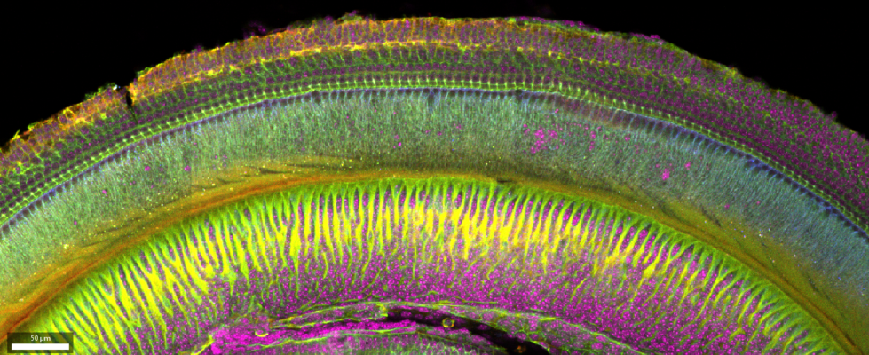

# Inicio

::: {.column-screen}
{width="75%" fig-align="center" alt="Oído interno - Imagen promocional"}
:::

::: {.callout-important}
## 📢 ¡Inscripciones Abiertas para el Taller!
La convocatoria para postular al taller de **Formación de Formadores en Análisis de Bioimágenes** está abierta.

* **Fecha límite de inscripción:** 16 de julio de 2026 (2026-07-16)
* **Notificación de selección y adjudicación de becas:** A partir del 20 de julio de 2026
* **Formulario de Inscripción:** [¡Inscribite aquí!](https://forms.gle/Ym27rxzptfaWMsrN7){.btn .btn-success .btn-lg .rounded role="button"}
:::

¡Te damos la bienvenida al portal del **Taller de Fundamentos en Análisis de Bioimágenes (*Train-the-Trainer*)**! 

Este taller intensivo y presencial se llevará a cabo del **3 al 7 de agosto de 2026** en el Pabellón 0+Infinito, de la Facultad de Ciencias Exactas y Naturales de la Universidad de Buenos Aires (FCEN-UBA) en Buenos Aires, Argentina.

A diferencia de los cursos puramente técnicos, este taller tiene un formato de **Formación de Formadores (*Train-the-Trainer*)**. Nuestro propósito principal es capacitar a profesionales del área de bioimágenes para que no solo dominen metodologías de análisis avanzadas, sino que adquieran las herramientas pedagógicas y didácticas necesarias para **enseñar y replicar** de forma sostenible este conocimiento en sus instituciones de origen en Latinoamérica.

::: {style="text-align: center; padding: 1.5rem 0; display: flex; justify-content: center; gap: 10px; flex-wrap: wrap;"}
[📅 Ver Programa Completo](program.md){.btn .btn-primary .rounded}
[📚 Recursos del Curso](resources.md){.btn .btn-primary .rounded}
:::

---

## Sobre el Taller

### ¿A quién está dirigido?
Este taller está diseñado para **estudiantes de posgrado, investigadores/as, analistas de imágenes y personal técnico de laboratorios y de centros de microscopía o servicios científicos** de Argentina y de Latinoamérica que deseen:
1. Consolidar sus bases teóricas y metodológicas en el análisis cuantitativo de bioimágenes.
2. Adquirir y poner en práctica herramientas pedagógicas que les permitan diseñar lecciones, dictar talleres prácticos y transferir conocimientos de forma efectiva a otros miembros de su comunidad.

### ¿De qué trata el taller?
El curso implementa un **modelo de aprendizaje activo híbrido**:
* **Fase online asincrónica (a partir de mediados de julio):** Introducción de nivelación con lecturas, videos grabados y preparación de software (Fiji, Python, napari) de cumplimiento obligatorio para centrar el tiempo presencial en dinámicas aplicadas.
* **Fase presencial intensiva (3 al 7 de agosto):** Sesiones teórico-prácticas donde cada tema se divide en:
  1. *Conceptos clave:* Breve repaso del tema con resolución de dudas conceptuales complejas.
  2. *Diseño pedagógico:* Trabajo grupal enfocado en cómo enseñar el tema, diseñar ejercicios con muestras reales, evitar errores conceptuales típicos de los estudiantes y estructurar tareas de evaluación.

### ¿En qué temas nos enfocaremos?
* **Procesamiento de imágenes y fundamentos:** Formatos de datos, operaciones espaciales, filtrado y buenas prácticas.
* **Segmentación y cuantificación:** Extracción de características métricas de manera rigurosa y reproducible.
* **Automatización y flujos de trabajo:** Desarrollo y empaquetado de workflows reproducibles utilizando el ecosistema de Fiji/ImageJ, Python y Napari.
* **Machine y Deep Learning:** Introducción a algoritmos de aprendizaje automático para el análisis de bioimágenes, aprendiendo a presentarlos y enseñarlos con expectativas realistas.
* **Pedagogía práctica:** Diseño y adaptación de guías de ejercicios a las infraestructuras y contextos de origen de los participantes.

---

## Información Clave y Becas

::: {.grid}

::: {.g-col-12 .g-col-md-6}
### Fechas Clave
* **Cierre de Postulaciones:** 16 de julio de 2026
* **Notificación de Aceptación:** A partir del 20 de julio de 2026
* **Inicio Fase Asincrónica:** Mediados de julio de 2026
* **Taller Presencial:** 3 al 7 de agosto de 2026
:::

::: {.g-col-12 .g-col-md-6}
### Asistencia Económica
Gracias al apoyo parcial de **FUNDACEN** y fondos institucionales, disponemos de **becas de ayuda económica** para viaje y alojamiento, así como **exenciones de aranceles de registro** para participantes seleccionados de la región.
* Puedes solicitar el apoyo en la sección correspondiente del [formulario de inscripción](https://forms.gle/Ym27rxzptfaWMsrN7).
:::

:::

---

## Organización e Instructores

::: {.columns}

::: {.column width="50%"}
### Comité Organizador

* **Dr. Agustín A. Corbat** (DF - FCEN - UBA)
* **Dra. Lorena Sigaut** (DF - FCEN - UBA & CMA)
* **Dra. Lía I. Pietrasanta** (DF - FCEN - UBA & CMA)
:::

::: {.column width="50%"}
### Instructores y Facilitadores

* **Dr. Ignacio Sallaberry** (FCEN - UBA)
* **Lic. Mauro Silberberg** (FCEN - UBA)
* **Lic. Alejandra Fernández** (FCEN - UBA)
* **Fis. Elizabeth Samaniego Onofre** (FCEN - UBA)
* **Gina A. Alongi** (FCEN - UBA)
:::

:::

### Profesores Invitados
* **Dr. Enzo Ferrante** (UNL / CONICET, Argentina) – Teoría y fundamentos de Deep Learning aplicados a Bioimágenes.
* **Dr. Federico Lecumberry** (Universidad de la República, Uruguay) – *Por confirmar*.

---

### Instituciones Organizadoras y de Apoyo

::: {layout-ncol=3}

:::

**Contacto:** [cma.taller.ab@gmail.com](mailto:cma.taller.ab@gmail.com)

---

## Citation

Corbat, A. A., Sigaut, L., & Pietrasanta, L. I. (2026). Taller de Fundamentos en Análisis de Bioimágenes (Train-the-Trainer). Zenodo. <https://doi.org/10.5281/zenodo.18247226>